# **EXPLAIN介绍**

## **EXPLAIN是什么？**

　　使用EXPLAIN关键字可以模拟优化器执行SQL查询语句，从而知道Mysql是如何处理你的SQL语句的。分析你的查询与或是表结构的性能瓶颈

## **EXPLAIN的如何使用?**

EXPLAIN的用法比较简单，只要要查询语句前面加上EXPLAIN即可

```text
1explain select * from tbl_emp;
```

运行结果如下

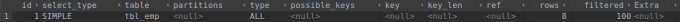

现在也许我们还不知道这些字段是什么意思，下面我们将围绕着这些字段进行展开讲解

## **id**

### 介绍

　　select查询的序列号，包含一组数字，表示查询中执行select字句或操作表的顺序
其中id的取值分为三种情况：

- id相同，执行顺序由上往下
- id不同，如果是子查询，id的序号会递增，id值越大优先级越高，越先被执行
- id相同不同，同时存在

下面我们来看看这三种情况到底是怎样的情况

**id相同，执行顺序由上往下**

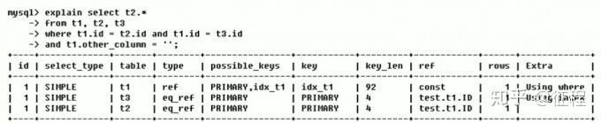

**id不同，如果是子查询，id的序号会递增，id值越大优先级越高，越先被执行**

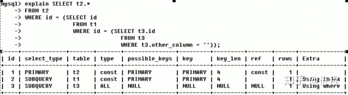

**id相同不同，同时存在**

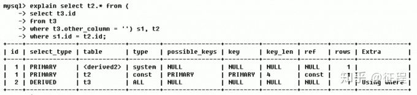

解释：id值如果相同，可以认为是一组，从上往下顺序执行；在所有组中，id值越大，优先级越高，越先执行

## **select_type**

字段select_type的取值有如下几种:

- SIMPLE
  　　简单的select查询，查询中不包含子查询或者UNION
- PRIMARY
  　　查询中若包含任何复杂的子部分，最外层查询则被标记为PRIMARY
- SUBQUERY
  　　在select或where列表中包含了子查询
- DERIVED
  　　在from列表中包含的子查询被标记为DERIVER(衍生)，Mysql会递归执行这些子查询，把结果放在临时表中
- UNION
  　　若第二个select出现在UNION之后，则被标记为UNION
    　　若union包含在from字句的查询中，外层select将被标记为：DERIVER
- UNION RESULT
  从UNION表获取结果的select

## **table**

显示这一行的数据是关于哪张表的

## **type**

字段type的取值有如下几种:

### **ALL**

Full Table Scan，将遍历全表以找到匹配的行

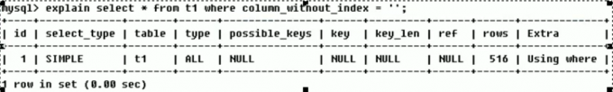

### **index**

Full Index Scan,index与All的区别为index类型只遍历索引树。这通常比All快，因为索引文件通常比数据文件小。（也就是说虽然all和index都是读全表,但index是从索引中读取的，而all是从硬盘中读取的）

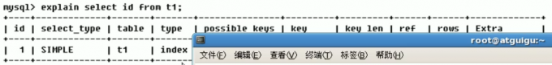

其中id为主键，即是索引

### **rang**

只索引给定范围的行，使用一个索引来选择行。key列显示使用了哪个索引，一般就是在你的where语句中出现了between、< 、>、in等查询，这种范围扫描索引扫描比权标扫描要好，因为它只需要开始与索引的某一点，而结束于另一点，不用扫描全部索引

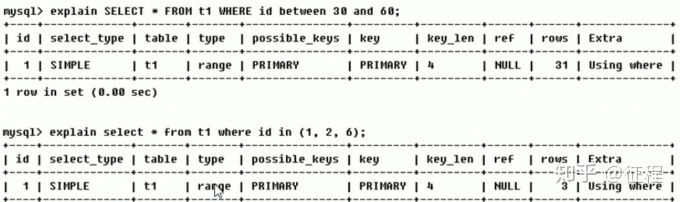

### **ref**

非唯一性索引扫描，返回匹配某个单独值的所有行，本质上也是一种索引访问，它返回所有匹配某个单独值的行，然而，它会可能找到多个符合条件的行，所以他应该属于查找和扫描的混合体

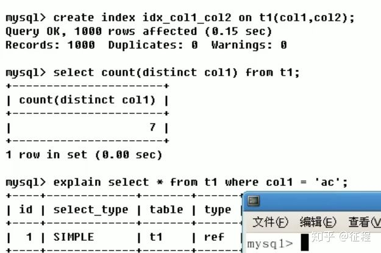

### **eq_ref**

唯一索引扫描，对于每个索引键，表中只有一条记录与之匹配。常见于主键或唯一索引扫描

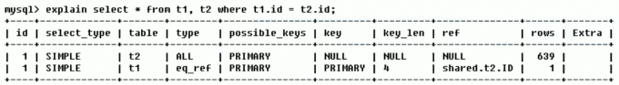

### **const**

表示通过索引一次就找到了，const用于比较`primary key`或`unique`索引。因为只匹配一行数据，所以很快。如将主键置于where列表中，Mysql就能将该查询转化为一个常量

### **system**

表只有一行记录（等于系统表），这是const类型的特例，平时不会出现，这个也可以忽略不计。

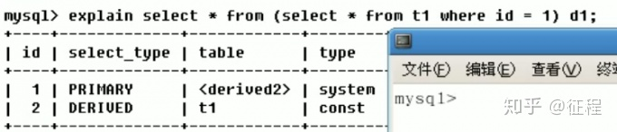

### **NULL**

性能的最好到最差依次是：system > const > eq_ref > ref > range > index > ALL

## **possible_keys&keys**

possible_keys显示可能应用在这张表中的索引，一个或多个。查询涉及到的字段上若存在索引，则该索引将被列出，但不一定被查询实际使用。key为实际使用的索引。如果为NULL，则没有使用索引。查询中若使用了覆盖索引，则该索引仅出现在key列表中


该结果显示表明：没有可能用到的索引，实际没有用到索引


根据第一行数据显示：可能用到的索引为PRIMARY和idx_t1，实际使用的索引是idx_t1

## **key_len**

表示索引中使用的字节数，可通过该列计算查询中使用的索引长度。在不损失精度性的情况下，长度越长越好。key_len显示的值为索引字段的最大可能长度，并非实际使用的长度，即key_len是根据表定义计算而得，不是通过表内检索出来的


由表可以知道，Mysql以key(col1,col2）为索引，第一个表表示以col1为条件进行查询，精度没有那么高，所需的索引长度为13,第二个表表示以col1,col2为条件进行查询，精度比较高，所需的索引长度为26

## **ref**

显示索引的哪一列被使用了，如果可能的话，是一个常数。哪些列或常量被用于查找索引列上的值。


ref列的const表示使用了常数('ac'),shared.t2.col1表示使用了share库t2表的col1字段对应查询语句的t2.col1

## **rows**

根据表统计信息及索引选用情况，大致估算出找到所需的记录所需要读取的行数

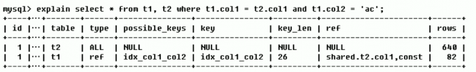

从表中可以看出第一次查询扫描了640行，第二次查询扫描了82行

## **Extra**

包含不适合在其他列中显示但十分重要的信息
Extra有如下几个取值：

### **Using filesort**

说明mysql会对数据使用一个外部的索引排序，而不是按照表内的索引顺序进行读取。Mysql中无法利用索引完成的排序操作称为“文件排序”


### **Using temporary**

使用了临时表保存中间结果，Mysql在对查询结果排序时使用临时表。常见于排序order by和分组查询group by


### **Using index**

表示相应的select操作中使用了覆盖索引，避免访问了表的数据行，效率不错！如果同时出现using where,表明索引用来执行索键值的查找；如果没有同时出现using where，表明索引用来读取数据而非执行查找动作


### **Using where**

表明使用了where过滤

### **using join buff**

表明使用了连接缓存

### **impossible where**

where字句的值总是false，不能用来获取任何元组

### **select tables optimized away**

在没有group by子句的情况下，基于索引化min/max操作或者对于MyISAM存储引擎优化count(*)操作，不必等到执行阶段再进行计算，查询执行计划生成的阶段即完成优化

### **distinct**

优化distinct操作，在找到第一匹配的元组后即停止找同样值的动作