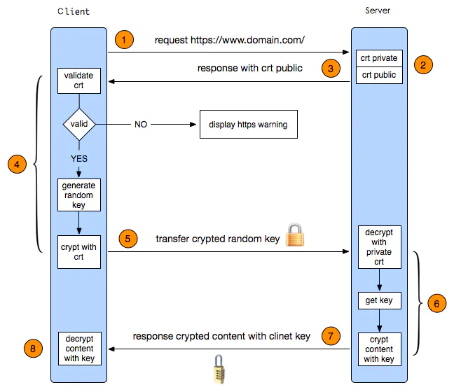

# SSL协议

## SSL协议工作流程

1.client 发出请求

2.server 收到请求，并自己生成一对密钥，即 公钥S 和 私钥S

3.server 把生成的 公钥S 传递给 client (除了 公钥S ，还有很多额外信息)

4.client 收到 公钥S 后进行判断，若无效，弹出警告，否则生成一串随机数，我们称之为 私钥C ，然后 client 用 server 传过来的 公钥S 对该随机数加密，形成【私钥C】

5.client 把【私钥C】传递给 server

6.server 收到【私钥C】，用 私钥S 把【私钥C】解密成 私钥C，然后把需要传递的数据用 私钥C 进行加密

7.server 把【数据】传递给 client

8.client 收到【数据】，用 私钥C 解密，完成一波收割

SSL协议非对称加密和对称加密配合使用。非对称加密安全但加解密速度慢，对称加密相对来说不安全，但速度快。对称加密加密数据，非对称加密加密对称加密的密钥，更安全